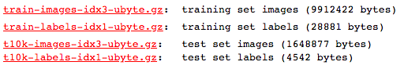

# 
Recognition of Handwritten Digits in MNIST Database 

#### 
Name : Wang Chengtian,  ID : 20474881 

---
## 
Catalog
---
** 1. Project Description**  
  - The Handwritten Digits
  - MNIST Database

** 2. Preprosessing with PCA Algorithm**
  - The basis steps of Principle Component Analysis method
  - The error rate with the dimension of PC changing

** 3. Recognition with KNN Algorithm**
  - The principle of KNN algorithm
  - The error rate with k changing

** 4. Conclusion**

----
##  
Content 
---
#### Project Description

*  **The Handwritten Digits**

The project is to recognize the Handwritten Digits. The Handwritten Digits contain the number from 0 to 9. Since they are Handwritten, there will be some differences with the print numbers and it will increase the difficulty of recognition. Below are some samples of Handwritten Digits.

* **MNIST Database**

We choose MNIST database as the Handwritten Digits database.

The database is composed of 4 files.

---
#### Preprosessing with PCA Algorithm
- **The basis steps of Principle Component Analysis method**

Principal Component Analysis is a good tool to identify main characteristics of a data set. It is computationally efficient for recognition and dimensionality reduction.

In this project, the images are composed of 28 \* 28 pixels. In other words the images are 28 \* 28 dimensions. Actually the priciple component is only 20 to 50 dimensions. So the computing with other dimensions is wasteful. Then we need to use PCA method to preprocess the data, reducing dimension from 784 to 40.

The steps of PCA:
1. Calculate the mean of the matrixs and remove the mean from the image matrix
2. Calculate the covariance matrix
3. Calculate the eigenvalues and eigenvectors of the covariance matrix.
4. Sort the eigenvalue and choose top 40 eigenvalues and the corresponding eigenvectors, composing the eigenvectors zone.
5. The image matrixs with removed mean overshadow the eigen zone.

The code are written, refering to some PCA methods with numpy lib (cov, eig, argsort...) in GitHub .
  - **The error rate with the dimension of PC changing**

To know how error rate changes with the dimensions changing, a simulation was done to show the errRate changing with PCA_DIM. The below picture is result with dimension changing from 1 to 101 in a step of 5.

As shown in the picture, the errRate decreases significantly with PCA_DIM from 1 to 21 and stay steady after 40. Then we assume that 45 is the best PCA_DIM in this project. The accuracy may decrease a bit after 45, but the complex of computation increases a lot. As a tradeoff, I choose 45 as the PCA_DIM.

Then I plot the the image reconstructed with PCA in different dimensions and get the figure below:

In this figure, when Dim is 7, it shows the main eigens but not enough to recognition. When Dim is 49, there appears more eigens. While it almost reconstructs the original picture with Dim of 343. However, it is much more complex to compute.

---
#### Recognition with KNN Algorithm

  - **The principle of KNN algorithm**

The k-nearest neighbors algorithm is to choose the k nearest neighbors and get the classes of them. The test image will be classified as the most nearest neighbors in k.

For example, if k is 10 and 10 nearest neighbors are 1,1,1,2,2,2,2,3,4,5, since the number of 2 is the most, the test image will be classified as 2.

When we test a image, we first overshadow it into the eigenZone. Then calculate the Euclidean Distance with the training dataset and choose the class appearing most frequently.

Codes are written bwhich is refering to the algorithm of KNN method in CSDN.

  - **The error rate with k changing**

Then I wonder how errRate changes with k and I do a simulation. The picture below is the result with a step of 50.

As we can see in the figure, errRate increases with k getting larger. However, we can't get the best k because the step is too large. Thus I do one more simulation with step of 2 in 1 to 50. The result is shown below.

In this figure, the errRate changes randomly with k increasing. So in this project, we cannot get an optimal k but a range of k and I choose k of 18.

---
##  
Conclusion 
---
According to the result of the simulation, with PCA and KNN method, the recognition accuracy can rise to 97% using k of 18 and PC dimension of 45. It may be the highest only using PCA and KNN, while PCA is used for preprocessing to increase accuracy and reduce the complexity of computation, KNN is used for recognition. What's more, if we want to reduce the error rate, some more preprocessings are needed or we can use some more complex method.
