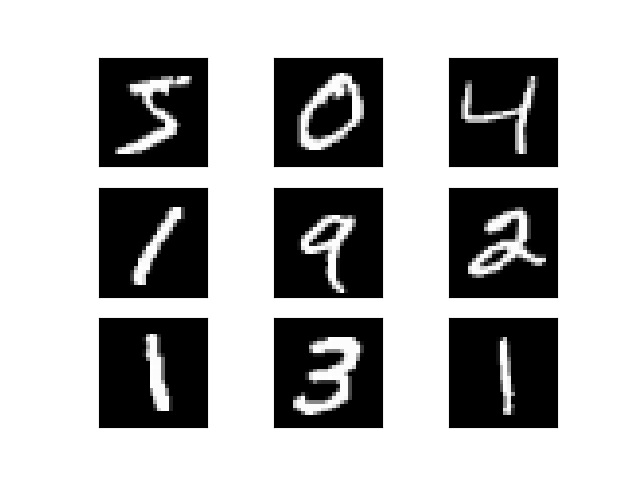
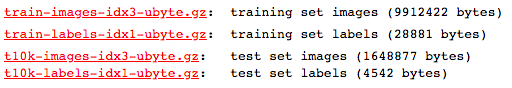
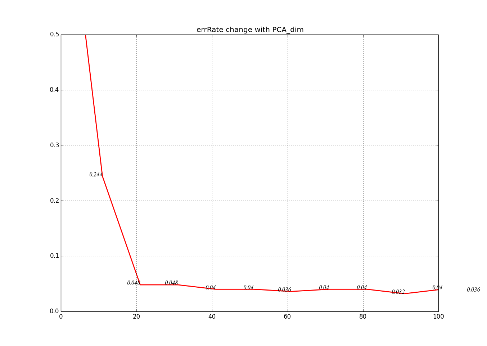
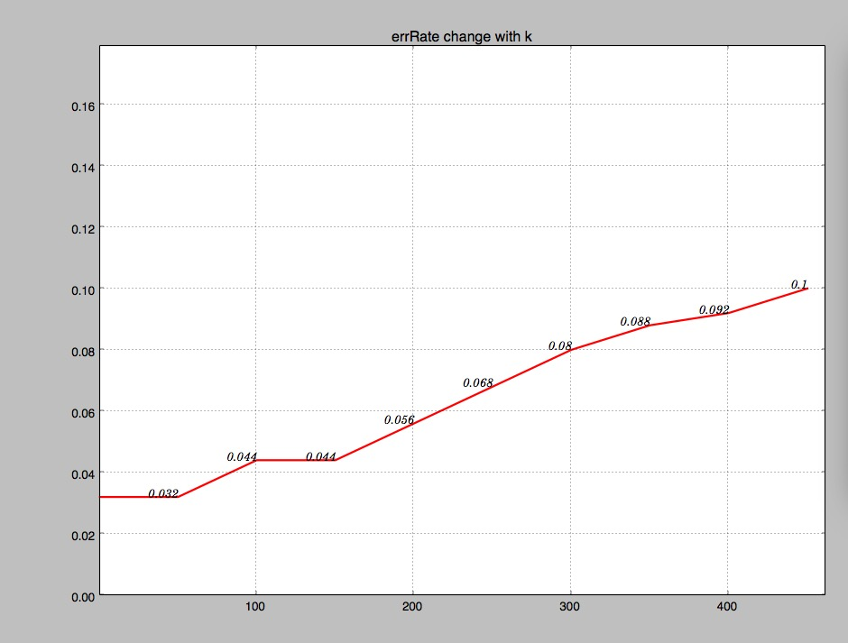
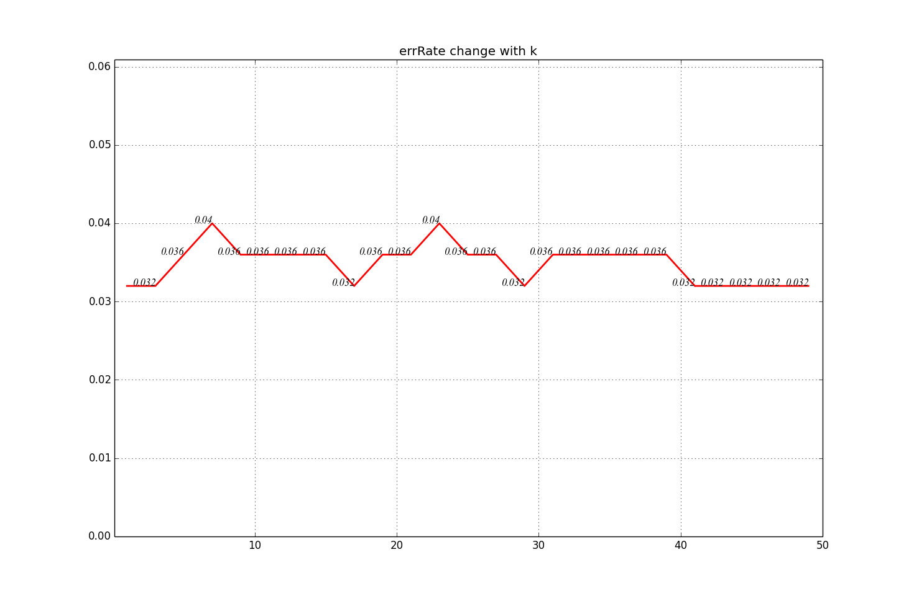

# <center><font size="5">Recognition of Handwritten Digits in MNIST Database</font><br /></center>
  
#### <center><font size="2">Name : Wang Chengtian,  ID : 20474881</font><br /></center>
  
## <center><font size="5">Catalog
  
---
**<font size="4"> 1. Project Description**  
  - The Handwritten Digits
  - MNIST Database
  
**<font size="4"> 2. Preprosessing with PCA Algorithm**
  - The basis steps of Principle Component Analysis method
  - The error rate with the dimension of PC changing
  
**<font size="4"> 3. Recognition with KNN Algorithm**
  - The principle of KNN algorithm
  - The error rate with k changing
  
----
## <center><font size="5">Content</font><br />
  
---
#### Project Description
  
  
*  The Handwritten Digits
  
The project is to recognize the Handwritten Digits. The Handwritten Digits contain the number from 0 to 9. Since they are Handwritten, there will be some differences with the print numbers and it will increase the difficulty of recognition. Below are some samples of Handwritten Digits.

  
* MNIST Database
  
We choose MNIST database as the Handwritten Digits database.
  
As the description of the database, the MNIST database of handwritten digits, available from this page, has a training set of 60,000 examples, and a test set of 10,000 examples. It is a subset of a larger set available from NIST. The digits have been size-normalized and centered in a fixed-size image.
  
The database is composed of 4 files.

All the integers in the files are stored in the MSB first (high endian) format used by most non-Intel processors. Users of Intel processors and other low-endian machines must flip the bytes of the header.
  
We first need to read the data in the files and change them into image matrixs. The codes below are needed.
```python
#read magic, numImages , numRows , numColumns of training images
filename = '/Users/mac/Downloads/train-images-idx3-ubyte'    
binfile = open(filename , 'rb')    
buf = binfile.read()    
index = 0      
magic, numImages , numRows , numColumns = struct.unpack_from('>IIII' , buf , index)    
index += struct.calcsize('>IIII')
#read magic, numImages , numRows , numColumns of testing images  
filename1 =  '/Users/mac/Downloads/train-labels-idx1-ubyte'    
binfile1 = open(filename1 , 'rb')    
buf1 = binfile1.read()    
index1 = 0     
magic1, numLabels1 = struct.unpack_from('>II' , buf , index)    
index1 += struct.calcsize('>II')  
```
  
#### Preprosessing with PCA Algorithm
  
- The basis steps of Principle Component Analysis method
  
Principal Component Analysis is a good tool to identify main characteristics of a data set. It is computationally efficient for recognition and dimensionality reduction.
  
In this project, the images are composed of 28*28 pixels. In other words the images are 28*28 dimensions. Actually the priciple component is only 20 to 50 dimensions. So the computing with other dimensions is wasteful. Then we need to use PCA method to preprocess the data, reducing dimension from 784 to 40.
  
The steps of PCA:
1. Calculate the mean of the matrixs and remove the mean from the image matrix
2. Calculate the covariance matrix
3. Calculate the eigenvalues and eigenvectors of the covariance matrix.
4. Sort the eigenvalue and choose top 40 eigenvalues and the corresponding eigenvectors, composing the eigenvectors zone.
5. The image matrixs with removed mean overshadow the eigen zone.
  
The code are written below, refering to some PCA methods with numpy lib (cov, eig, argsort...) in GitHub .
```python
 def pca(DataMat, topN):  
    global eigenZone  
    meanVals = mean(DataMat, axis=0)      
    #remove mean
    meanRemoved = DataMat - meanVals  
    covMat = cov(meanRemoved, rowvar=0)
  
    eigVals,eigVects = linalg.eig(mat(covMat))  
    #sort, sort goes smallest to largest  
    eigValInd = argsort(eigVals)
    eigValInd = eigValInd[:-(topN+1):-1]  
    #cut off unwanted dimensions  
    redEigVects = eigVects[:,eigValInd]   
    #reorganize eig vects largest to smallest   
    lowDDataMat = meanRemoved * redEigVects
    #transform data into new dimensions  
    reconMat = (lowDDataMat * redEigVects.T) + meanVals  
    return lowDDataMat, reconMat
```
  - The error rate with the dimension of PC changing
  
To know how error rate changes with the dimensions changing, a simulation was done to show the errRate changing with PCA_DIM. The below picture is result with dimension changing from 1 to 101 in a step of 5.
  

  
As shown in the picture, the errRate decreases significantly with PCA_DIM from 1 to 21 and stay steady after 40. Then we assume that 40 is the best PCA_DIM in this project. The accuracy may decrease a bit after 40, but the complex of computation increases a lot. As a tradeoff I choose 40 as the PCA_DIM.
#### Recognition with KNN Algorithm
  
  
  - The principle of KNN algorithm
  
The k-nearest neighbors algorithm is to choose the k nearest neighbors and get the classes of them. The test image will be classified as the most nearest neighbors in k.
  
For example, if k is 10 and 10 nearest neighbors are 1,1,1,2,2,2,2,3,4,5, since the number of 2 is the most, the test image will be classified as 2.
  
When we test a image, we first overshadow it into the eigenZone. Then calculate the Euclidean Distance with the training dataset and choose the class appearing most frequently.
  
Codes are written below which is refering to the algorithm of KNN method in CSDN.
```python
def KNN(inX, dataSet, labels, k):  
    dataSetSize = dataSet.shape[0]  
    diffMat = tile(inX, (dataSetSize,1)) - dataSet  
    sqDiffMat = diffMat**2  
    sqDistances = sqDiffMat.sum(axis=1)
    distances = sqDistances**0.5  
    sortedDistIndicies = distances.argsort()  
    classCount={}            
    for i in range(k):  
        voteIlabel = labels[sortedDistIndicies[i]]  
        classCount[voteIlabel] = classCount.get(voteIlabel,0) + 1  
    sortedClassCount = sorted(classCount.iteritems(), key=operator.itemgetter(1), reverse=True)  
    return sortedClassCount[0][0]  
```
  
  - The error rate with k changing
  
Then I wonder how errRate changes with k and I do a simulation. The picture below is the result with a step of 50.

  
As we can see in the figure, errRate increases with k getting larger. However, we can't get the best k because the step is too large. Thus I do one more simulation with step of 2 in 1 to 50. The result is shown below.

In this figure, the errRate changes randomly with k increasing. So in this project, we cannot get an optimal k but a range of k and I choose k of 16.
  
## <center><font size="5">Conclusion</font><br />
  
  